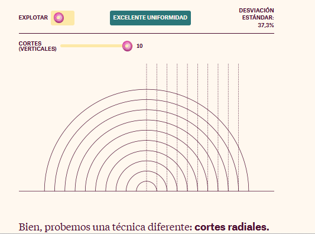
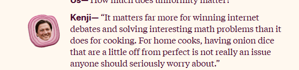
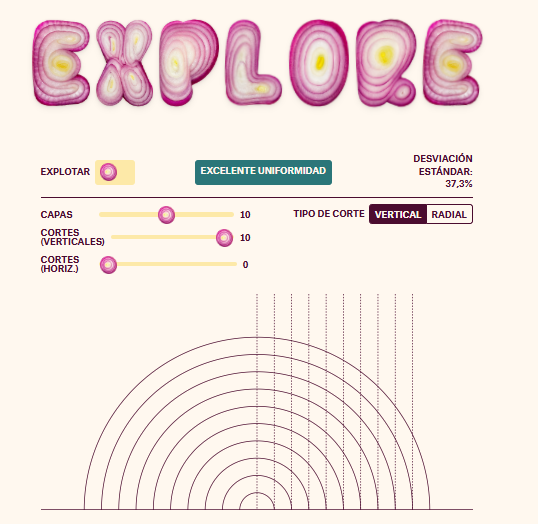

# Análisis de la historia web "Cebollas: Una historia de datos"
## *Onions: A Data Story* 

Visita la historia Web: https://pudding.cool/2025/08/onions/

### *Descripción de la historia que cuenta*

La historia web "Onions: A Data Story" explora datos relacionados con la producción, consumo y características de las cebollas en diversas regiones. La historia utiliza datos estadísticos, mapas interactivos, diagramas y gráficos para contar cómo diferentes países y culturas interactúan con este alimento. La narrativa se apoya en datos para explicar tendencias, destacar hechos sorprendentes y contextualizar la importancia de las cebollas en la dieta y economía global.

### *Aspectos interesantes y estructura narrativa*
Lo que hace interesante esta historia es como logra inovar en un tema tan trivial como lo es la cebolla y su capacidad para combinar datos complejos y tecnicos con una narrativa clara y atractiva. La estructura sigue un ritmo facil que guía al usuario desde una introducción sencilla hasta un análisis detallado y visualmente llamativo. Personalmente me dio curiosidad la posibilidad de este articulo y me impresionó lo mucho que hay que decir y como se muestra de manera entretenida,todo en relación al tema. La historia narrativa tiene todo pensado, desde elementos que se piensan que son basicos como los titulos y subtitulos formado por cebollas cortadas en forma de la palabras, hasta graficos que siguen la misma estetica, pero sin saturarlo. 
La historia narrativa nace de una pregunta que se hace mucho en internet, tomando un elemento basico para enganchar a la gente y atraerla desde lo cotidiano _¿Cuál es la manera más optima de cortar la cebolla?_ para explicar cosas más complicadas sobre estas misma. No se hace pesado porque la estructura parece estar diseñada para que cada cierto porcentaje de dato duro haya un elemento que devuelva al espectador a lo cotidiano.  

La historia combina texto con visualizaciones dinámicas, permitiendo al usuario interactuar con los datos para descubrir información adicional. Se mantiene un buen equilibrio entre texto y elementos visuales, haciendo la experiencia inmersiva pero sin saturar.

### *Evaluación de la efectividad para transmitir información*
Los gráficos y mapas interactivos facilitan la comprensión de patrones y relaciones dentro de los datos, mientras que la narrativa escrita complementa y contextualiza esos elementos visuales. La interacción con el usuario—por ejemplo, la posibilidad de filtrar información o explorar diferentes opciones y resultados de los cortes de la cebolla—incrementa la participación y ayuda a una mejor retención del contenido, Ya que despues de todo el texto escrito que recopila tiene un elemento interactivo que hace que la audiencia vea y aplique todo lo que se espera que se haya aprendido. 

La calidad de los datos presentados es alta, con referencias claras y fuentes transparentes. En conjunto, la historia web es efectiva para transmitir información compleja de manera clara y atractiva.

_Trabajo escrito por: Paloma Riquelme_

